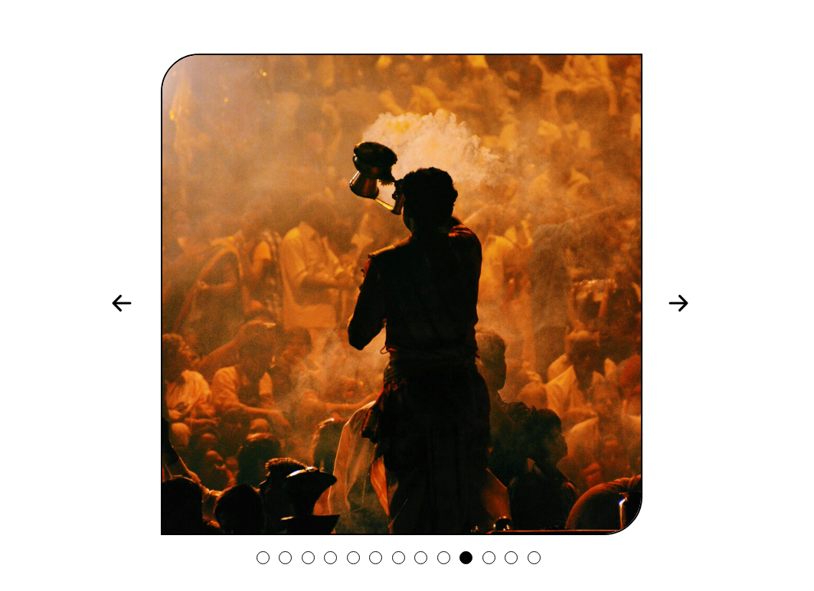

# IMAGE CAROUSEL

## ABOUT 
This project is a part of lesson [Dynamic user Inerface Interaction](https://www.theodinproject.com/lessons/node-path-javascript-dynamic-user-interface-interactions). We were asked to make two simple project - [Drop Down Menu](https://github.com/Sahilcreate/drop-down-menu) & an [Image Carousel](https://github.com/Sahilcreate/image-carousel).

[Click here](https://sahilcreate.github.io/image-carousel/) to view live.

## OBJECTIVES
- [x] It should contain arrows on each side to advance the image forward or backward
- [x] It should automatically move forward every 5 seconds
- [x] It should contain the little navigation circles at the bottom that indicate which slide you are on
- [x] The navigation circle also should be clickable to advance to that particular slide